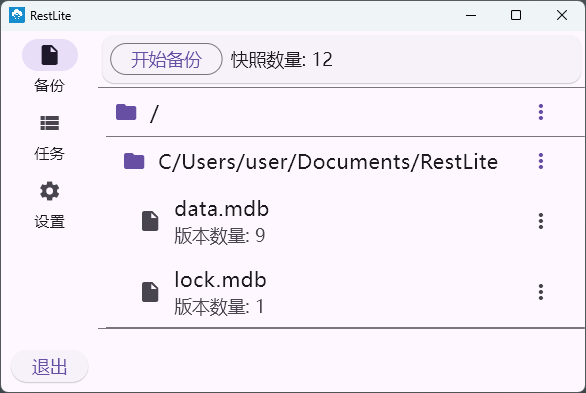

# RestLite

[English README](doc/README.en.md)

RestLite是适用于windows平台的文件备份工具，提供简单直观的定时备份与恢复功能。

本质为[restic](https://github.com/restic/restic) GUI

## 功能

- 手动备份

- 自动备份

  以自定义间隔运行备份任务，实现自动周期备份

- 自动删除过期快照

  按照自定义过期时间检查备份过期情况，自动删除过期备份

- 按照文件目录浏览快照

- 下载备份文件

## 安装与使用

请至 [GitHub Releases](https://github.com/rest-lite/RestLite/releases) 进行下载

## 卸载

除应用与备份仓库外，还应该删除数据库与配置文件：

数据库位置:
`%userprofile%\Documents\RestLite`

配置文件位置:
`%userprofile%\AppData\Roaming\rest-lite`

## 未来开发计划

- 多仓库支持或限制为单实例
- 更好的文件浏览性能
- linux平台支持
- 快照视图以及快照管理功能
- 更安全的密码保存方式
- Windows Installer
