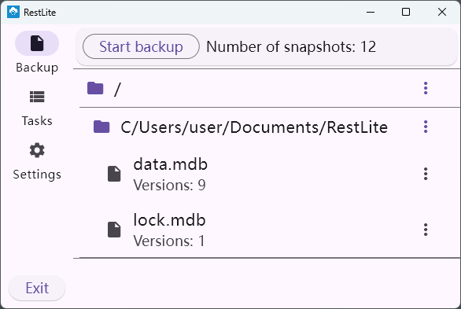

# RestLite

[中文说明](doc/README.zh.md)

RestLite is a file backup tool for the Windows platform that offers a simple and intuitive way to perform scheduled backups and restores.

It is essentially a GUI for [restic](https://github.com/restic/restic).

## Features

- Manual backups

- Automatic backups
  Run backup tasks at custom intervals to achieve periodic automatic backups

- Automatic deletion of expired snapshots
  Check backup expiration based on custom expiration time and automatically delete expired backups

- Browse snapshots by file directory

- Download backup files

## Installation and Usage

Please download from [GitHub Releases](https://github.com/rest-lite/RestLite/releases)

## Uninstallation

In addition to the application and backup repository, you should also delete the database and configuration files:

Database location:
`%userprofile%\Documents\RestLite`

Configuration file location:
`%userprofile%\AppData\Roaming\rest-lite`

## Future Development Plans

- Support for multiple repositories or restriction to a single instance
- Improved file browsing performance
- Support for the Linux platform
- Snapshot view and snapshot management features
- More secure password storage
- Windows Installer
